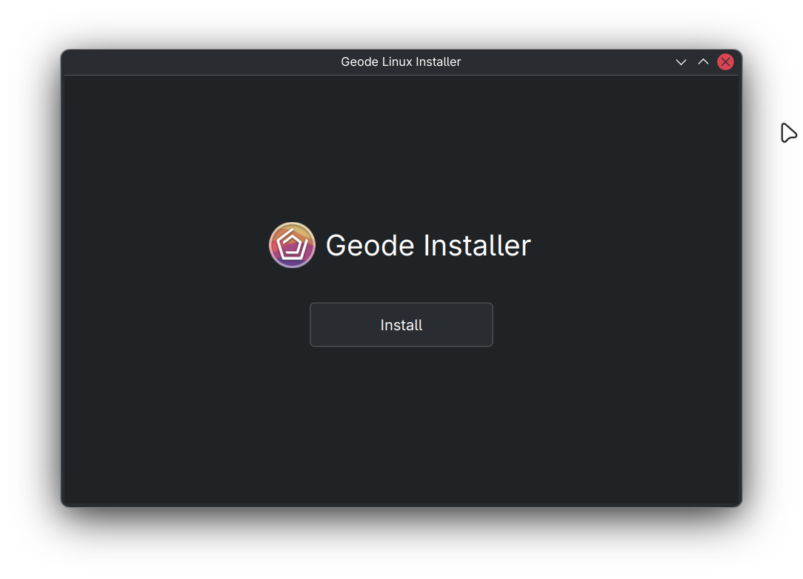

# Geode Linux Installer

Simple Geode installer for Linux, written in Qt/C++.

To build this, you need to install Qt development libraries on your system (I don't care about your choice, you know how to do it on your distro).

